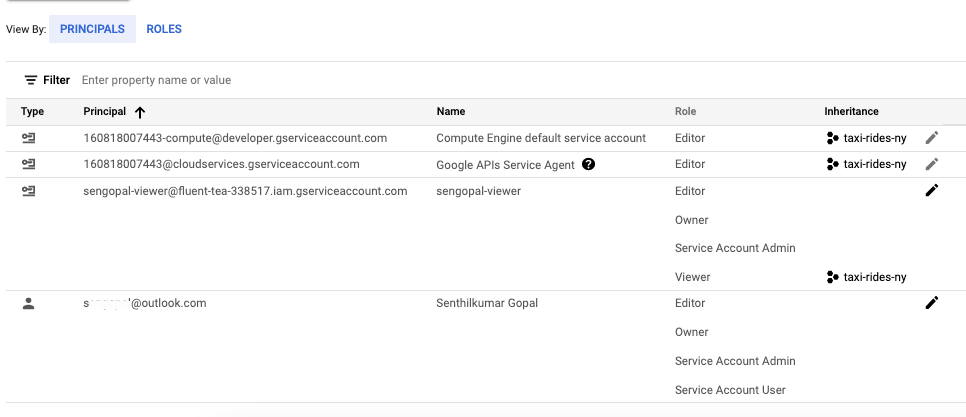
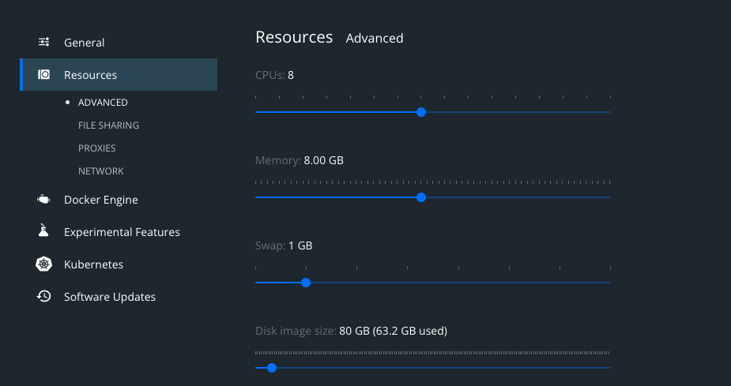

# Pre-Requisities
The following steps are required to be setup before the project can be executed.

## Google Cloud Account Setup
1. Google Account to create and manage the cloud account
2. Create an Cloud Provider account with your Google email ID at https://console.cloud.google.com/
3. Setup a Google cloud project and note down the project ID. Will be referred as `fluent-tea-338517` in the code and documentation for reference.   
   1. This will be used when deploying the infrastructuer with Terraform and for other other references.
   2. The variable `GCP_PROJECT_ID` is set as this value in [docker-compose.yml](airflow/docker-compose.yml)

## Service Account and Permissions
1. Create a service account via [service account & authentication](https://cloud.google.com/docs/authentication/getting-started) for this project
2. Ensure all these permissions are provided for both the service account and the Google Account created - `Editor | Owner | Service Account Admin | Viewer`



> Note: Adding `Storage Admin | Storage Object Admin | BigQuery Admin | Viewer` should be sufficient for the project to work. But since this was an educational project, it was tested with wider access as denoted earlier. The project was not tested with only these specific access types`

3. Enable these APIs for your project:
   1. https://console.cloud.google.com/apis/library/iam.googleapis.com
   2. https://console.cloud.google.com/apis/library/iamcredentials.googleapis.com
   
4. Download service-account-keys (.json) for authentication and set up at `~/.google/credentials/google_credentials.json` 

5. **Note:** This specific path and file is used in docker files as well. So it is important to set up the path here as is. 

6. Set the environment variable as `export GOOGLE_APPLICATION_CREDENTIALS="~/.google/credentials/google_credentials.json"`

## Terraform
1. Authenticate with Google cloud platform using google auth - `gcloud auth application-default login` - Should see page with message `You are now authenticated with the gcloud CLI!`

2. Incase you see the message ` The environment variable [GOOGLE_APPLICATION_CREDENTIALS] is set to:[~/.google/credentials/google_credentials.json], Credentials will still be generated to the default location:   [~/.config/gcloud/application_default_credentials.json]` - Please continue as **Y**

3. The primary principal access would be used for Terraform and to provision the Infrastructure while the Service account credentials would be used for managing the workflow.

4. Install Terraform - reference [Zoomcamp](https://github.com/DataTalksClub/data-engineering-zoomcamp/blob/main/week_1_basics_n_setup/1_terraform_gcp/README.md)
5. Once Terraform is successfully installed and the google auth is completed, proceed with creating the infrastructure.
6. Change into the terraform directory - `cd terraform` and run `terraform init` to confirm terraform can be initialized successfully.
7. Run `terraform plan -var="project=<project-id>"`. Replace `<project-id>` with `fluent-tea-338517` (project id created in first step)
8. Ideally the result should be `Plan: 2 to add, 0 to change, 0 to destroy.` - For creating the bucket and the dataset.
9. Run `terraform apply -var="project=<project-id>"` and confirm the changes and the two resources should now be created and available.

## Docker and docker-compose
The project files and runtime is configured using Docker and tested using Docker (version 4.6.1) and
Compose (version 2.3.3) and tested with the following configuration.



1. All the needs for the project is configured using docker and docker-compose under the `airflow` folder.

> Note: There are many variations and specifics to make docker run within each OS. Please refer to [zoomcamp](https://github.com/DataTalksClub/data-engineering-zoomcamp/blob/main/week_2_data_ingestion/README.md) instructions for setting up docker and airflow if you are facing any of the common setup issues. The docker-compose is an exact replica for airflow from the zoomcamp and updated to support jupyter and spark additionally.

2. Following are the variables of importance within the `/airflow/docker-compose.yml` file
   1. `GCP_PROJECT_ID: 'fluent-tea-338517'`
   2. `GCP_GCS_BUCKET: "dtc_data_lake_fluent-tea-338517"`

3. Ensure these two are consistently updated with the project id and bucket created earlier.

### Executing Docker and running Airflow/Spark
1. Build the image (only first-time, or when there's any change in the `Dockerfile`). This takes ~15 mins for the first-time or even more for slower internet speeds.

```shell
docker-compose build
```

2. Initialize the Airflow scheduler, DB, and other config

```shell
docker-compose up airflow-init
```

3. Kick up the all the services from the container

```shell
docker-compose up
```

4. Login to Airflow web UI on `localhost:8080` with default creds: `airflow/airflow`

5. Run the following DAGs in sequence.
   1. [Spotify Data Ingestion](airflow/dags/spotify_data_ingestion_v1.py)
   2. [Spark Transformation](airflow/dags/spark_transformation_v10.py)

> Note: The very first run of the airflow goes to retry due to the logs not being initialized with the error message `*** Log file does not exist: /opt/airflow/logs/spotify_data_ingestion_v2/download_dataset_task/2022-03-31T03:49:39.705949+00:00/1.log
*** Fetching from: http://:8793/log/spotify_data_ingestion_v2/download_dataset_task/2022-03-31T03:49:39.705949+00:00/1.log
*** Failed to fetch log file from worker. Request URL missing either an 'http://' or 'https://' protocol.
` . Simply wait from the task to retry and it will work fine and the subsequent runs does not have this issue.


6. The spark cluster can be accessed via http://localhost:8181/ to view the worker threads and logs.


7. On finishing your run or to shut down the container/s:

```shell
docker-compose down
```

### Datastudio
Once the data has been transformed and made available in BigQuery, Google Data studio can be used to visualize the data using [Google Datastudio](https://datastudio.google.com/reporting/aff15801-5893-4d55-a3bb-7466b9f27e4f)

### FAQ
2. `spark = SparkSession.builder.master('local').appName('bq').config("spark.jars.packages", "com.google.cloud.spark:spark-bigquery-with-dependencies_2.12:0.23.2").getOrCreate()` - Spark Session gets created with the connector and dependency jars downloaded at runtime for the first run. More details available [here](https://github.com/GoogleCloudDataproc/spark-bigquery-connector)


