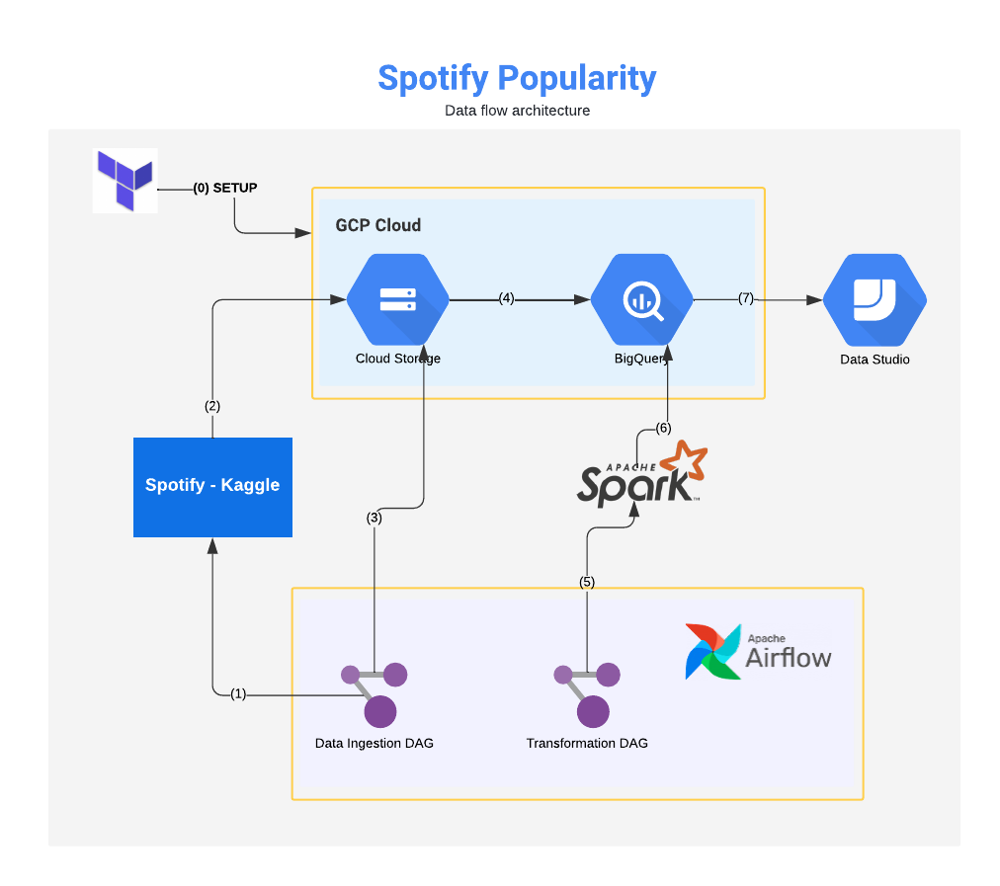
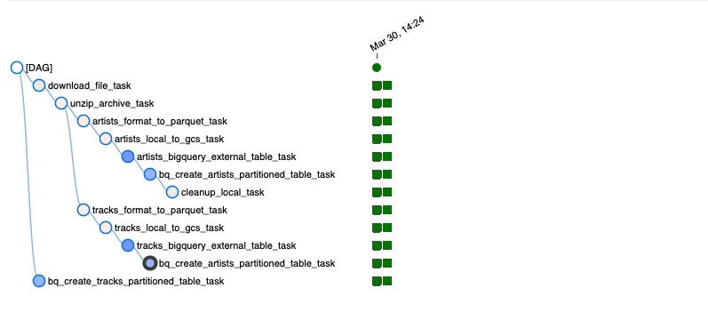
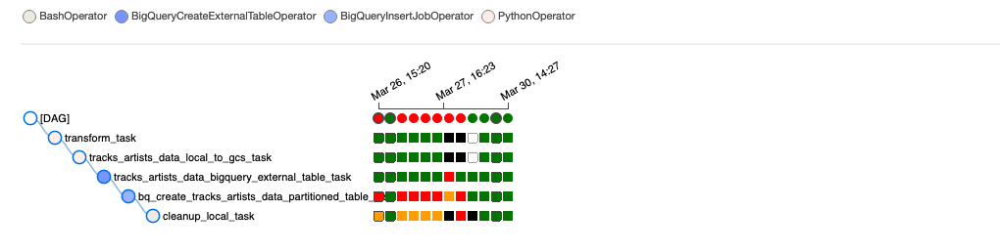
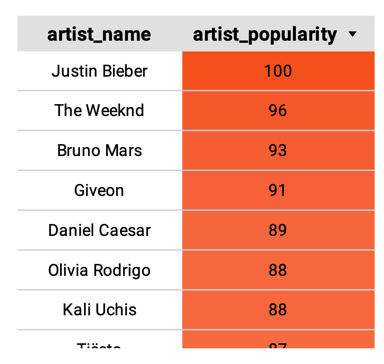
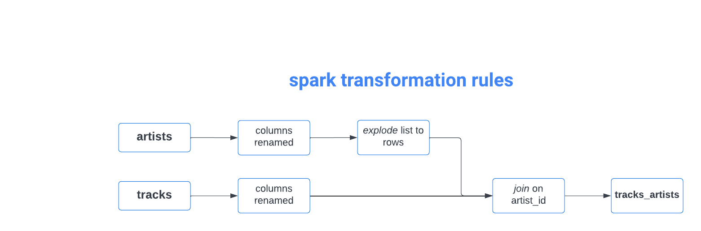

# Zoomcamp Project - Spotify Popularity

## Problem description
> This is a hypothetical and synthetic requirement formulated for the zoomcamp project. 

Spotify business wishes to review popular tracks and artists based on tracking metrics on a period basis (monthly/yearly) to help track and monitor features such as "Most Popular Artist", "Most Popular Song", "Trending tracks and artists" etc., To solve this need, the data engineering / analytics need to create a pipeline to convert the raw data collected for popularity into actionable dashboards for the business team to analyze and curate to form the "Trending tracks and artists" etc.,  

The pipeline refreshes data on a monthly basis with popularity information, pulling the raw data into data lake first for storage, extracting and transforming into trending data structure in cloud for easier dashboard construction from which business intelligence for trending and top hits can be easily obtained in a structured form.

The dataset is available from [Spotify Dataset](https://www.kaggle.com/yamaerenay/spotify-dataset-19212020-600k-tracks?select=tracks.csv)

## Technology choices

1. **Cloud Platform** - Google Cloud Platform (GCP)
2. **Datalake** - GCP Bucket
3. **Infrastructure as code (IaC)**: Terraform 
4. **Workflow orchestration**: Airflow
5. **Data Warehouse**: BigQuery 
6. **Transformations**: Apache Spark
7. **Dashboards**: Google Data studio

## High level design
This project utilizes a pipeline which:

* (0) Uses Terraform to manage the infrastructure
* (1) Pulls the raw data from Spotify/Kaggle which acts as the data generation source.
* (2) This raw source data is archived in the datalake as part of the Extract and Load in ELT
* (3) Airflow orchestrates the loading of the raw data into standard files in datalake Bucket.
* (4) Airflow then loads the raw files into BigQuery as standard tables
* (5) Airflow uses Spark to transform the artists and tracks data tables to provide popularity metrics 
* (6) The transformed data is also written them back into BigQuery for further analysis.
* (7) Google Data studio uses the transformed data to generate dashboard tiles.
 
This allows analytics to view the combined tracks and artists popularity information for quick review.

## Table Information
1. `artists` (raw table) - This table provides information about the artists, their popularity and their metadata. 
2. `tracks` (raw table) - This table provides information about the tracks, the artists, their popularity and their metadata.
3. `tracks_artists` (transformed table) - This table represents the combined data of `artists` and `tracks` table. There are other transformations necessary to flatten some of the information in these tables.

### Cloud and IaC
Google cloud platform is used as the **Cloud** infrastructure (BigQuery and BigStorage) for managing this data pipeline and **Terraform** is used to manage the Infrastructure as code.

### Workflow orchestration - Batch Processing
Since the popularity metrics are computed over a period of one month, **Batch processing** works well for this requirement, than streaming. Airflow is used as the orchestration/workflow management system for montly data pulls and loading into the data lake and for further usage. The end to end pipeline can be created as a simple heavily complex DAG. To improve readability and monitoring/observabiltiy of the DAGs, they have been logically created as two represented below.

The `spotify_data_ingestion` DAG works on reading the data from the data source and then loading all the raw data in the data lake, and its storage as standard tables in BigQuery.

The `spark_transformation` DAG works on creating the merged table for analysis and loads into BigQuery.

### Datawarehouse - BigQuery
BiQuery is used as the datawarehouse for this project. It houses all the source tables and also the transformed tables, which are used for further analysis. The raw source tables are loaded as is as the amount of rows are lesser than 1GB and are not directly used in any reports.

#### Clustering over Partitioning
The transformed table `tracks_artists_data` does not have any particular key which lends itself to partitioning, since the data is already aggregated at popularity level and partitioning based on any of the keys, results in only a small amount of data per partition. The cardinality of the number of values in artist_id and track_id, the two important attributes, is large, which makes the usage of partitioning more expensive.

However, the reporting is primarily based on the popularity of the artist and hence the data is clustered based on `artist_popularity.` This ensures that the order of the `artist_popularity` is highly prioritized for faster retrieval and clustering improves filtering and aggregation of queries, which is necessary for this project's analysis. 

Since clustering determines the sort order of the data stored, clustering by `artist_popularity` ensures that the top artists and top tracks are available for faster retrieval.

For example, the below part of the monthly report, directly orders the top trending artists based on their popularity and clustering based on `artist_popularity` directly helps enable faster retrieval.  

> Reference: [Zoomcamp on Partitioning vs Clustering](https://docs.google.com/presentation/d/1a3ZoBAXFk8-EhUsd7rAZd-5p_HpltkzSeujjRGB2TAI/edit#slide=id.g10eebc44ce4_0_26)

#### Transformations (dbt, spark, etc)
_4 points: Tranformations are defined with dbt, Spark or similar technologies_
Transformations of cleaning the data, converting lists in columns to flattened structures and combining the `artists` and `tracks` data were accomplished using an Apache Spark cluster.
 

The Spark transformation is triggered using the Airflow dag named `spark_transformation_v10` upon which the raw tables are transformed, combined and uploaded to BigQuery.

### Dashboard
The live datastudio was developed in **Google Data Studio** and can be viewed via [Datastudio link](https://datastudio.google.com/reporting/aff15801-5893-4d55-a3bb-7466b9f27e4f). A PDF view of the report is available at [Spotify Population Report](Spotify_Popularity_Report.pdf). The datastudio report tracks the following metrics.

1. Total number of tracks
2. Total number of artists
3. Total followers on the platform
4. Most popular tracks - by popularity
5. Most popular artists - by followers
6. Most popular artists - by popularity
7. Distribution of Popularity across top artists
8. Top artists by loudness of tracks

> **Loudness**: The overall loudness of a track in decibels (dB). Loudness values are averaged across the entire track and are useful for comparing relative loudness of tracks. Loudness is the quality of a sound that is the primary psychological correlate of physical strength (amplitude). Values typically range between -60 and 0 db. - [Spotify Reference](https://developer.spotify.com/documentation/web-api/reference/#/operations/get-audio-features)

### Reproducibility
The step-by-step instructions for installing and executing the steps of the project are available at [Installation Instructions](INSTALL.md)